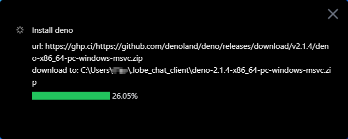
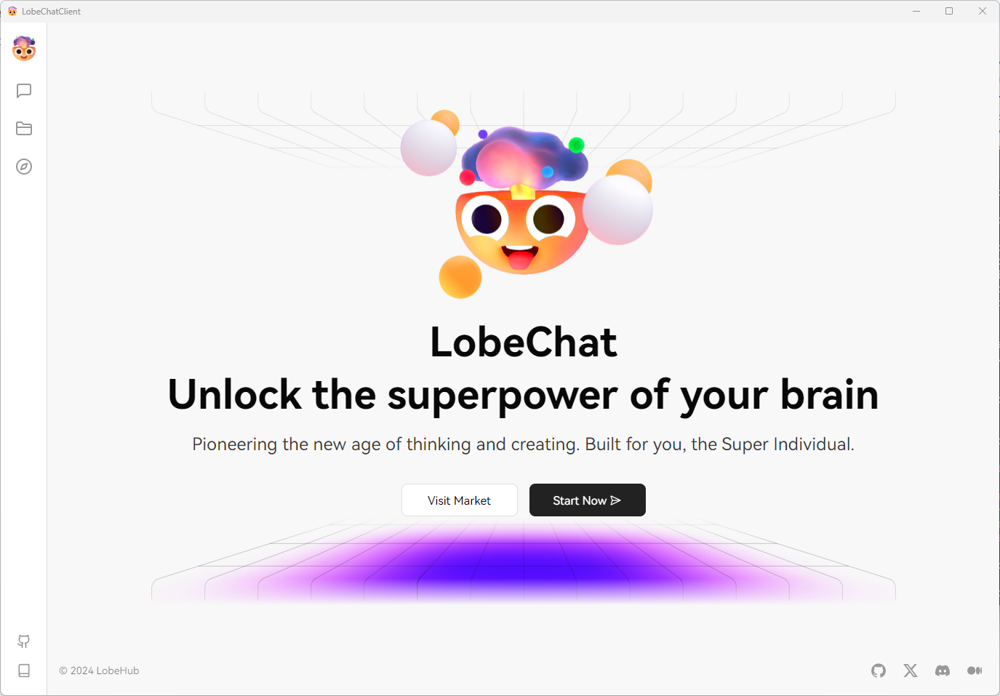

# LobeChatClient

本地启动 `LobeChat` 服务，大大加快网站访问速度。单独客户端，不用在众多的 `tabs` 中寻找 `LobeChat` 所在的 `tab` 了。

## 使用方式

下载客户端即可
 

如果下载速度过慢等，可以查看当前下载中的文件，并手动下载，放到对应的文件夹中，然后重新启动客户端。

比如这里是下载 `deno`，上面一行 `url` 显示了地址，可以从界面上复制，下面是下载后存放的目录，手动下载后放置到这里即可。

`LobeChat` 同理，都下载好了会启动服务并用新窗口显示 `LobeChat` 页面。

